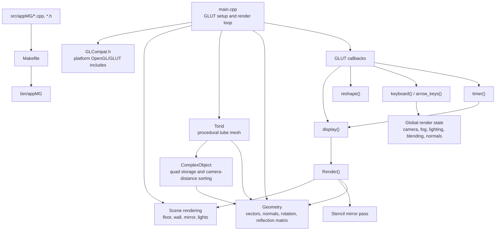

# MG OpenGL 2007

An old computer graphics coursework project built with OpenGL/GLUT. The source code is kept as close to the original as practical; the changes are limited to macOS compatibility and building with `make`.

## macOS Requirements

- macOS with Xcode Command Line Tools installed.
- No extra OpenGL libraries are required: the project links against the system `OpenGL` and `GLUT` frameworks.
- A compiler with C++17 support. The default macOS `clang++` from Command Line Tools is enough.

If `clang++` is not available, install Command Line Tools:

```sh
xcode-select --install
```

## Build

```sh
make
```

The executable is created here:

```sh
bin/appMG
```

## Run

```sh
make run
```

The application opens an 800x600 GLUT window. Press `Esc` to exit.

## Controls

- Arrow keys: move the camera on the X/Y axes.
- `A`: toggle antialiasing through the accumulation buffer.
- `B`: toggle object transparency.
- `F`: toggle fog.
- `L`: toggle lighting.
- `N`: show/hide normals.
- `1`-`4`: toggle light sources, if they have been created in the current frame.

## Clean

```sh
make clean
```

## macOS Compatibility Changes

- Added `src/appMG/GLCompat.h` for platform-specific GLUT includes.
- On macOS, `GetTickCount()` is provided through a compatibility wrapper around `glutGet(GLUT_ELAPSED_TIME)`.
- Replaced `void main` with standard `int main`.
- Added a `Makefile` that links against the system OpenGL/GLUT frameworks.

## Modernization Notes

- The project now builds as C++17 while still using the original immediate-mode OpenGL/GLUT rendering style.
- Fixed array ownership in `Torid`: arrays are released with `delete[]`, including the previously leaked normals array.
- Texture generation now uses `std::vector` instead of manual `malloc`/`free`.
- Rendering is driven by a GLUT timer instead of a busy idle callback, which avoids pegging the CPU while the scene is open.
- FPS is shown in the window title once per second instead of printing one line per frame to the terminal.

## Project Architecture


